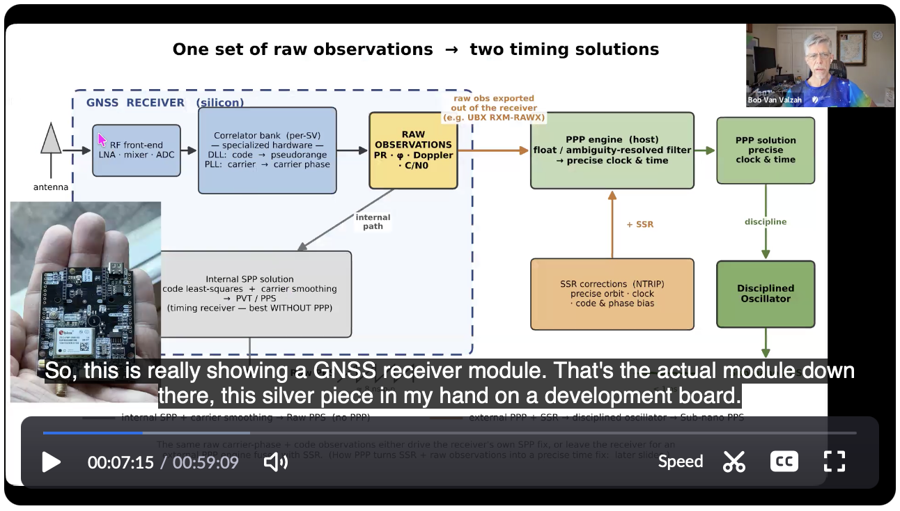

# subNanoAtHomeGnssAI

Presentation describing my efforts to build clocks with sub-nanosecond accuracy using GNSS and AI in a home time lab.

## Overview

I gave a presentation on July 9, 2026 at the
[STAC Summit](https://stacresearch.com/events/mini-summit-npl-london/) at the
[National Physical Laboratory (NPL)](https://www.npl.co.uk/)
in Teddington, London.

This talk is a sequel to my earlier presentation,
[Last Nanoseconds to UTC](https://github.com/bobvan/lastNs2utc)
(2025), which asked whether sub-nanosecond GNSS clock sync is even
possible. This one is about building it.

This presentation covers the research required to work in this area,
and the resulting
[PePPAR-Fix software](https://github.com/bobvan/PePPAR-Fix/)
for building precision GNSS clocks.

You can
[view the presentation PDF here on GitHub](https://github.com/bobvan/subNanoAtHomeGnssAI/blob/main/subNanoAtHomeGnssAI.pdf),
[download it for offline viewing](https://raw.githubusercontent.com/bobvan/subNanoAtHomeGnssAI/main/subNanoAtHomeGnssAI.pdf),
or
[watch a video recording of my "dress rehearsal" for the presentation](https://us06web.zoom.us/rec/share/1zvoQ55HAjh64t1HXOtMuHbLQsf9KlSkImf9Kdp5P-IfeTKznRcYh0pjgsGdbWsc.UuqJBDgil96nxSYb).

My presentation style is heavy on visuals and light on bullets,
with my narration giving the key points verbally, so viewers of the PDF
miss a bit of what the live audience heard.

## What the talk covers

I introduce my frame of reference as retirement from low-latency trading,
where precise network timestamps are required in datacenters — which left me
wondering about the limits of accurate clock synchronization using
fixed-position GNSS.

A section of slides provides background on the tradeoffs that must be
made between fast but approximate answers to position/time questions and
slower but more precise answers.

It's common to think of GPS satellites as autonomous master clocks.
This abstraction works fine until you need position/time accuracy better
than a handful of meters/nanoseconds.
The earthbound infrastructure supporting the satellites is what limits
accuracy.

The common GNSS chips in our cell phones use only the simplest processing
algorithms with the coarsest models and corrections to produce approximate
answers.
But the same received signals can be processed through more complex
algorithms using far more precise models and corrections to produce
more accurate answers by two or three orders of magnitude.

A largely visual section of the presentation focuses on GNSS antennas,
since they are a critical part of getting precise answers.

Without time to list all small effects that must be considered to get
accurate time, the presentation highlights three:

- **Intersystem bias** — Clock differences across GNSS constellations.
- **Datum offsets** — The land itself moves over time (plate motion), so positions must be tied to a dated reference frame.
- **Solid-Earth tides** — Believe it or not, the solid earth beneath you rises and falls about daily, adding GNSS errors if not accounted for.

## Implementation and results

I show a block diagram of PePPAR-Fix software that uses raw GNSS
carrier phase observations to precisely drive a disciplined oscillator.
This section includes a parts list totaling about $1000 and a photo
of one of the clock prototypes I built to run PePPAR-Fix.

Deviation plots show improvement over a simple GNSS PPS receiver and
the future work to be done in pursuit of better stability.
Progress toward two-clock agreement goals is given.

## Role of AI

This work covers about four months of fairly intense research in 2026.
I went from understanding only the basics of time via GNSS to a much
deeper appreciation for the work needed to get sub-nano performance.
I went from zero to 140,000 lines of Python code and tests
for processing GNSS signals
and disciplining precision oscillators.
None of this would have been possible without AI and the pioneering work
of others.
I give some thoughts on how I worked profitably with AI by giving my
agents great power, but limiting their blast radius if something were to go
wrong.

## If you want to build your own

One goal of this work was to leave a trail of crumbs for anyone who wants
to follow. The code is open source at
[PePPAR-Fix](https://github.com/bobvan/PePPAR-Fix/), and the slides include
a complete parts list. The measurement tools behind my earlier
[Last Nanoseconds to UTC](https://github.com/bobvan/lastNs2utc) work —
including the dual u-blox F9T experiments — are in
[f9tResearch](https://github.com/bobvan/f9tResearch/).

This all stands on the shoulders of others, especially
[Ole Petter Rønningen](https://no.linkedin.com/in/olepetter), who built
[the first PPP GPSDO](https://www.efos3.com/GPSDO/GPSDO.html), and
[John Ackermann, N8UR](https://www.febo.com/jra.html), for an inexpensive
time-interval counter and divider.
